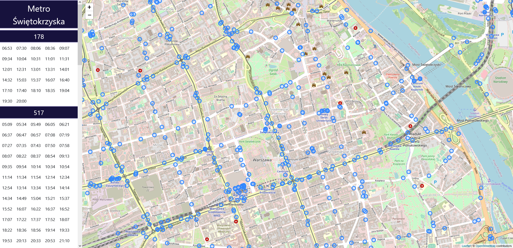

# Dojazdy

Aplikacja internetowa C# ASP.NET MVC pozwalająca na wyświetlenie odjazdów autobusów ZTM. Dane pobierane są z oficjalnego [api Urzędu Miasta Warszawa](https://api.um.warszawa.pl/).

## Uruchamianie

1. Skopiować `Dojazdy.fdb` do `C:\Dojazdy.fdb`
1. Uruchomić ISS Express na projekcie
1. Uruchomić [https://localhost:44341/Home/UpdatePrzystanki](https://localhost:44341/Home/UpdatePrzystanki)
1. Uruchomić [https://localhost:44341/](https://localhost:44341/)